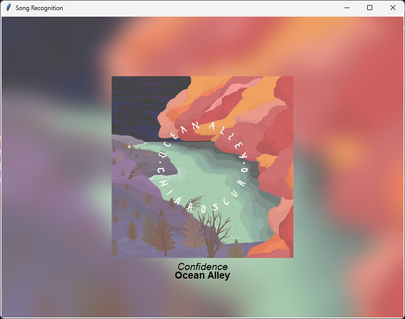

# SongPi - Song Recognition with Blurred Background

This project sets up a Python environment for recognizing songs using Shazamio, displaying album art with a blurred background, and dynamically adjusting text color based on background brightness. 
It uses Tkinter for the GUI and PyAudio for recording audio.

The following versions are available: 
- Raspberry Pi
- Windows (portable/easy as version: zip package that is already set up, just click the .exe to run)
- Windows (full/less easy version: installs a virtual Python environment and uses a script to run SongPi)

<details>
   <summary><h2>Raspberry Pi version</h2></summary>
   
### 1. Install Python 
Update the package list & install Python:
```
sudo apt update
sudo apt upgrade
sudo apt install python3
```
### 2. Create a virtual environment in the current folder and activate it
```
python3 -m venv venv
source venv/bin/activate
```
### 3. Install the required dependicies: 
```
pip install pyaudio shazamio requests pillow screeninfo
```
### 4. Run SongPi
```
python shazam.py
```
When you're done, deactivate the virtual environment by running:
```
deactivate
```
</details>

<details>
   <summary><h2>Portable Windows setup instructions</h2></summary>

### 1. Download the 7zip file [Here](https://github.com/Mildywot/SongPi/blob/main/SongPi%20-%20portable%20Windows/SongPi%20-%20portable%20Windows.7z)
(normal zip file wouldn't go smaller than 25MB for GitHub lol)


### 2. Extract the file and run ***SongPi.exe***
Enjoy 
</details> 


<details>
   <summary><h2>Full Windows setup instructions</h2></summary>

### 1. Download and extract the full Windows version from the releases section


### 2. Install Python

Install Python 3.12.3 from the Python website: https://www.python.org/downloads/release/python-3123/ 
(other Python versions probably work fine, just haven't tested them)

***Make sure that you select the 'add python.exe to PATH' option during the install.***


### 3. Run the Setup Script

Double click '1st time setup.bat' and let the script run until it finishes, if you get an error then try run it again I reckon. 
The script creates a virtual environment in Files\venv within your current folder, then installs four Python packages (pyaudio, shazamio, requests, and pillow screeninfo) using pip install.

***Once you've done the above setup the first time, you can just click the Start.bat file next time you want to run the program***


### 4. Run the script

Double click the 'Start.bat' file, it loads a virtual Python environment and runs the SongPi code for you.
</details> 

# Examples:
## Windowed



## Full screen


## Tips:

- Press Esc button to toggle between full screen and windowed mode, feel free to resize the window to your heart's content.
- Make sure your PC has a microphone (USB and built-in mics work well I think, haven't tested much else)
- Enjoy?! Let me know if you like it or have suggestions

Cheers.
