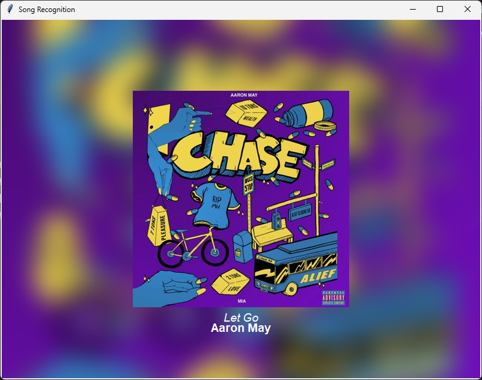

# Song Recognition with Blurred Background

This project sets up a Python environment for recognizing songs using Shazamio, displaying album art with a blurred background, and dynamically adjusting text color based on background brightness. The project uses Tkinter for the GUI and PyAudio for recording audio.

The following versions are available: 
- Raspberry Pi
- Windows (easy as: zip package that is already set up, just click the .exe to run)
- Windows (less easy: installs a virtual Python environment and uses a script to run SongPi)

## Raspberry Pi
### 1. Install Python 
Update the package list:
```
sudo apt update
sudo apt upgrade
```
Install Python:
```
sudo apt install python3
```
Create a virtual environment in the current folder:
```
python3 -m venv venv
```
Activate the virtual Python environment:
```
source venv/bin/activate
```


## Less easy Windows mode setup instructions

### 1. Install Python

Install Python 3.12.3 from the Python website: https://www.python.org/downloads/release/python-3123/ 
(other Python versions probably work fine, just haven't tested them)

***Make sure that you select the 'add python.exe to PATH' option during the install.***


### 2. Run the Setup Script

Double click '1st time setup.bat' and let the script run until it finishes, if you get an error then try run it again I reckon. 
The script creates a virtual environment in the current folder and installs four Python packages (pyaudio, shazamio, requests, and pillow screeninfo) using pip install.

***Once you've done the above setup the first time, you can just click the Start.bat file next time you want to run the program***


### 3. Run the script

Double click the 'Start.bat' file, it loads a virtual Python environment and runs the SongPi code for you.

# Examples:
## Windowed




## Full screen


## Tips:

- Press Esc button to toggle between full screen and windowed mode, feel free to resize the window to your heart's content.
- Make sure your PC has a microphone (USB and built-in mics work well I think, haven't tested much else)
- Enjoy?!

Cheers.
